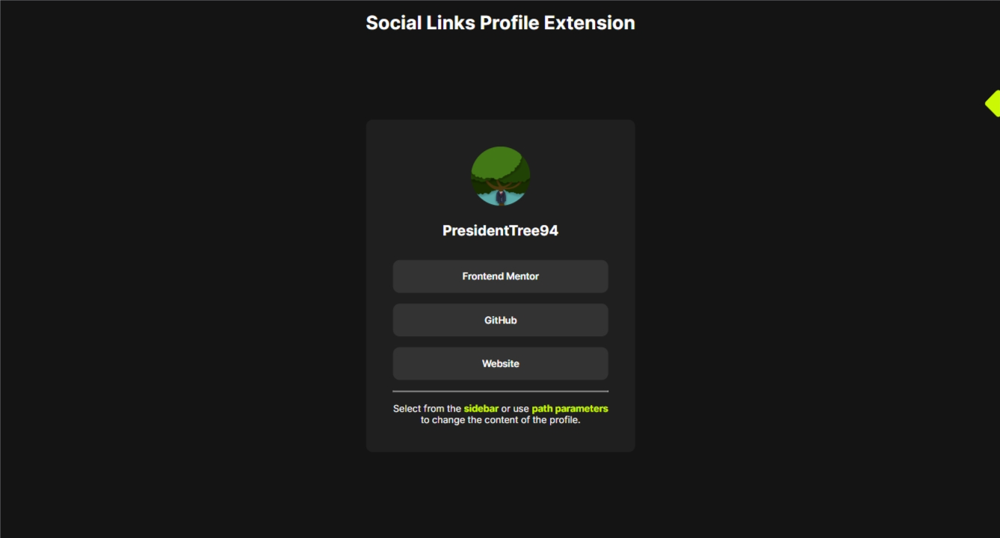

# Social Links Profile Extension - Social Links Profiles
This is the React extension of the [Social Links Profile](https://www.frontendmentor.io/solutions/social-links-profile-Eb1ydPJOT_) challenge on [Frontend Mentor](https://www.frontendmentor.io/challenges/social-links-profile-UG32l9m6dQ). I designed it to look similar to the original project but with extra features to make it more interactive.

## Overview
Unlike the base project that is simply a card listing five social media links for a user, the user can now switch between four profiles. The user can select a profile from the hover sidebar or by changing the path parameter in the URL. The script retrieves the username included in the URL using `useParams()` and returns the profile from the JSON data file. The default profile is the first profile in the JSON data file, which the user can be redirected to by going to the start page or inputting a non-existant user. Each profile has a username, avatar, accent color, and a list of varying social media links and platforms. The accent color is passed using `useEffect()`.

## Author
- GitHub Profile: [PresidentTree94](https://github.com/PresidentTree94)
- Frontend Mentor Profile: [PresidentTree94](https://www.frontendmentor.io/profile/PresidentTree94)
- Author Website: [PresidentTree94 Portfolio](https://presidenttree94.github.io/project-portfolio/)